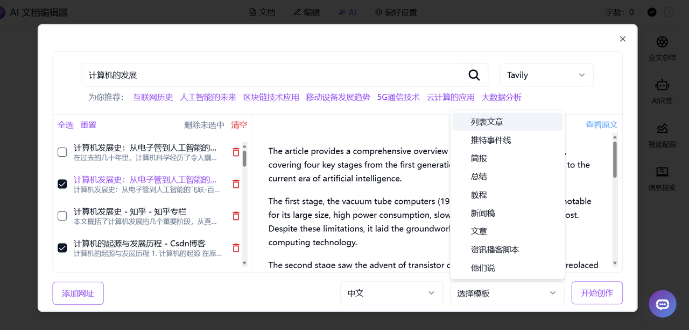

# 💻🤖 欢迎来到302.AI的 AI 文档编辑器! 🚀✨
AI文档编辑器利用语言大模型辅助用户进行长文创作，提供类似Word的编辑体验，提供高质量的AI全文总结、全文翻译、全文改写、全文朗读、智能配图、一键生成长文功能，提供九种风格化文档模板以供选择，并支持将文档导出为多种格式。

  <a href="README_zh.md">中文 |</a>
  <a href="README.md">English |</a>
  <a href="README_ja.md">日本語</a>

来自[302.AI](https://302.ai)的[AI 文档编辑器](https://302.ai/tools/word/)的开源版本。
你可以直接登录302.AI，零代码零配置使用在线版本。
或者对本项目根据自己的需求进行修改，传入302.AI的API KEY，自行部署。

## 界面预览

## 项目特性

### 🤖 AI 智能助手
- **智能翻译**: 支持多种语言翻译
- **内容改写**: 智能重写内容，保持原意的同时优化表达
- **智能总结**: 自动生成全文或段落摘要
- **AI 配图**: 根据文本内容自动生成相关插图
- **信息检索**: 智能搜索相关信息并生成摘要
- **一键生成长文**：根据标题自动生成长文

### ✍️ 文本编辑增强
- **段落处理**
  - 智能改写
  - 自动总结
  - 多语言翻译
  - 内容扩写
  - 智能缩写
  - 上下文续写
- **编辑操作**
  - 文本替换
  - 智能插入
  - 快速复制
### ✨文档模板风格化：
以下九种文档模板可供选择
- **列表文章**
- **推特事件线**
- **简报**
- **总结**
- **教程**
- **新闻稿**
- **文章**
- **资讯播客脚本**
- **他们说**
    

### 🌍 多语言支持
- 中文界面
- English Interface
- 日本語インターフェース

通过 AI 文档编辑器，我们能为创作提供全方位的支持，包括多语言翻译、内容改写、智能总结、配图生成等功能，让创作过程更加流畅高效。 🎉💻 让我们一起探索AI驱动的代码新世界吧! 🌟🚀

🛠️ 技术栈
前端框架: Next.js
编辑器核心: Novel.js
国际化: next-i18next

## 未来更新计划
- 上新更多文档模板以供选择
- 新增文本编辑格式刷功能，快速复制文本或对象的格式，并将其应用到其他文本或对象上
- 新增AI修正语法拼写功能，对文本中的语法或拼写错误进行智能识别和纠正

## 开发&部署
1. 克隆项目 `git clone https://github.com/302ai/302_document_editor`
2. 安装依赖 `pnpm install`
3. 配置302的API KEY 参考.env.example
4. 运行项目 `pnpm dev`
5. 打包部署 `docker build -t document-editor . && docker run -p 3000:3000 302_document-editor`

## ✨ 302.AI介绍 ✨
[302.AI](https://302.ai)是一个按需付费的AI应用平台，为用户解决AI用于实践的最后一公里问题。
1. 🧠 集合了最新最全的AI能力和品牌，包括但不限于语言模型、图像模型、声音模型、视频模型。
2. 🚀 在基础模型上进行深度应用开发，我们开发真正的AI产品，而不是简单的对话机器人
3. 💰 零月费，所有功能按需付费，全面开放，做到真正的门槛低，上限高。
4. 🛠 功能强大的管理后台，面向团队和中小企业，一人管理，多人使用。
5. 🔗 所有AI能力均提供API接入，所有工具开源可自行定制（进行中）。
6. 💡 强大的开发团队，每周推出2-3个新应用，产品每日更新。有兴趣加入的开发者也欢迎联系我们
